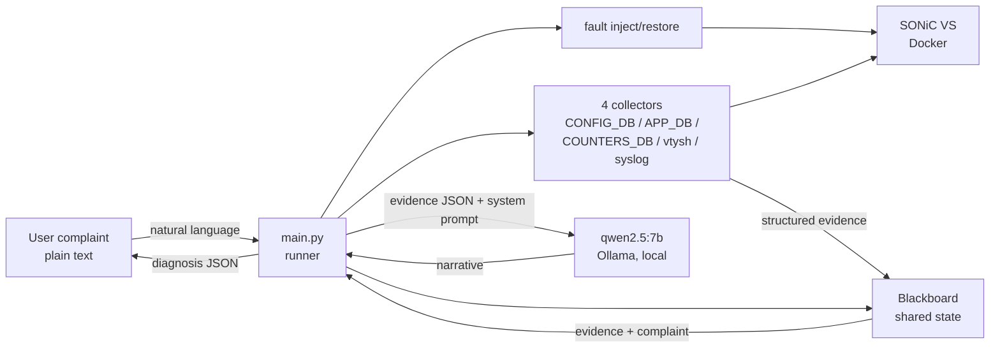

# Autonomous Network Troubleshooting Agent for SONiC

This is a portfolio project that takes a vague natural-language network complaint and produces a diagnosis grounded in live switch state. The user describes a network problem in plain English on a SONiC virtual switch. The agent investigates by reading live state from CONFIG_DB, APP_DB, COUNTERS_DB, vtysh, and syslog, populates a shared blackboard with structured evidence, and asks a local 7B model to narrate a diagnosis. Built entirely local on a MacBook M4 Pro with Ollama and Docker. No cloud APIs.

The project is structured in five phases. Phases 1 through 3 are shipped today: one interface scenario (`interface_admin_down`) plus two BGP scenarios (`bgp_neighbor_removal`, `bgp_asn_mismatch`) all running end-to-end, with four specialist agents (triage, interface, BGP, logs) fanning out hypotheses to the shared blackboard before a synthesis agent fans in. Phases 4 (evaluation harness) and 5 (polish + writeup) are possible future work, not committed deliverables. "Autonomous" in the project title refers to the architectural intent; current autonomy is `--scenario` dispatch across the registered scenarios under the multi-agent blackboard, not free-form troubleshooting of arbitrary complaints.

## Why this exists

Configuration intent is well-understood. Project 1 of this portfolio (sonic-intent-agent) covered that pattern: take a clear instruction, propose, verify, approve, apply, verify. Troubleshooting from vague complaints is harder because the investigation path emerges from evidence rather than from a predetermined plan. The blackboard pattern fits this shape: a shared workspace where structured evidence accumulates and a narrator interprets the accumulated picture.

NIKA (arxiv 2512.16381) benchmarks LLM agents on this problem against Kathara-emulated networks. I did not find a SONiC-equivalent open troubleshooting benchmark in the prior art reviewed for this project. Commercial implementations exist (Aviz Network Copilot uses a fine-tuned Llama 70B on SONiC; Cisco announced AgenticOps with multi-hypothesis autonomous troubleshooting in February 2026). This project is an open-source educational version of that pattern using a 7B local model.

## Architecture

Three decisions shape everything that follows.

Python owns investigation flow. Qwen narrates structured evidence; it does not decide what to investigate. The reason is honest: 7B-scale models are too weak to drive multi-step troubleshooting reliably. The NIKA benchmark reports GPT-OSS:20B at 19% / 5.5% / 5.5% on detection / localization / root-cause-analysis tasks, and `qwen2.5:7b-instruct` is smaller. Python collects facts; Qwen explains them.

Blackboard at the top level. A shared Python object holds evidence, hypotheses, and the final diagnosis. Mutation is explicit through methods; reads return defensive deep copies so the audit trail can only be modified through `add_evidence`, `add_hypothesis`, and `set_diagnosis`. The blackboard maps to the exploratory nature of troubleshooting: Cisco AgenticOps publicly describes "validating multiple hypotheses simultaneously", and Phase 3 implements a local version of that pattern with four specialist agents posting hypotheses before synthesis.

Diagnose only, no remediation. The system prompt forbids the model from suggesting next commands or remediation steps, even when the obvious fix would be a single line. The `restore` step in `main.py` is lab cleanup for the injected fault, not autonomous fix-application.

The Phase 1 flow:

    +-----------------+       +------------------+
    | User complaint  |       | qwen2.5:7b       |
    |   (plain text)  |       | (Ollama, local)  |
    +--------+--------+       +--------+---------+
             |                         ^
             v                         |
    +-----------------+    evidence    |
    |    main.py      +--------------->+
    |    (runner)     |    narrative   |
    +--------+--------+<---------------+
             |
       +-----+------+----------+----------+
       |            |          |          |
       v            v          v          v
    +-----+   +----------+ +----------+ +-----------+
    |fault|   |collectors| |blackboard| |  Ollama   |
    |inject|  |   x4     | | (shared  | |   HTTP    |
    +--+--+   +-----+----+ |  state)  | +-----------+
       |            |      +----------+
       |            v
       |     +-----------+
       +---->|SONiC VS   |
             |  (Docker) |
             +-----------+

The same flow as a Mermaid diagram (visible when this README is viewed on GitHub):

The diagrams above describe the Phase 1 flow with a single LLM in the narrator role. Phase 3 inserts a fan-out / fan-in step between blackboard population and the diagnosis call: four specialist agents (triage, interface, BGP, logs) read their assigned evidence slice from the blackboard concurrently and post hypotheses, then the diagnosis agent synthesizes evidence plus specialist hypotheses. All five agents use the same local `qwen2.5:7b-instruct` instance via Ollama; specialization comes from prompt constraints and the evidence slice each agent sees, not from model capability. See [`phase3/README.md`](phase3/README.md) for the concurrency model, the `[triage]`/`[interface]`/`[bgp]`/`[logs]` claim-tag attribution scheme, and the honest limitations of running four LLM calls against a single local Ollama instance.

## Status: Phases 1-3 shipped

Three phases are shipped end-to-end.

**Phase 1** — one hardcoded interface scenario (`interface_admin_down`) running end-to-end with a single narrator agent over four collectors. See [`phase1/README.md`](phase1/README.md).

**Phase 2** — two-container BGP lab fixture (`scripts/configure_bgp.sh` brings up a peer FRR container on a dedicated Docker network and converges the SUT to `Established`) and two BGP fault scenarios (`bgp_neighbor_removal`, `bgp_asn_mismatch`) registered alongside the Phase 1 scenario. Both scenarios mutate SUT BGP state via `vtysh`; the CONFIG_DB + `bgpcfgd` mutation path was deliberately deferred — see [`phase2/2C_CONTROL_PLANE_DECISION.md`](phase2/2C_CONTROL_PLANE_DECISION.md). See [`phase2/`](phase2/) for spike, decision, and findings docs.

**Phase 3** — multi-agent participation on the blackboard: four specialist agents (`triage`, `interface_specialist`, `bgp_specialist`, `logs_specialist`) write hypotheses to the shared blackboard via a `ThreadPoolExecutor` fan-out, and the diagnosis agent performs fan-in synthesis over evidence plus specialist hypotheses. See [`phase3/README.md`](phase3/README.md).

Files that make up the current build:

    scripts/bringup.sh                  brings SONiC services to operational state
    scripts/configure_bgp.sh            two-container BGP lab fixture (up / down / status)
    faults/interface_admin_down.py      Phase 1 fault (CONFIG_DB admin shutdown)
    faults/bgp_neighbor_removal.py      Phase 2 BGP fault (vtysh)
    faults/bgp_asn_mismatch.py          Phase 2 BGP fault (vtysh)
    collectors/sonic_state.py           four evidence collectors
                                        (interface state, counters,
                                        BGP summary, syslog)
    blackboard/blackboard.py            shared state container with set-once
                                        diagnosis and deep-copy isolation
    agents/triage.py                    Phase 3 triage specialist
    agents/interface_specialist.py      Phase 3 interface-layer specialist
    agents/bgp_specialist.py            Phase 3 BGP specialist
    agents/logs_specialist.py           Phase 3 logs specialist
    agents/diagnosis.py                 Qwen synthesis over evidence + hypotheses
    main.py                             end-to-end runner with --scenario dispatch
                                        and Phase 3 fan-out / fan-in

## Quickstart

Prerequisites (one-time setup):

- Docker Desktop on macOS with at least 12 CPUs and 7-8 GB RAM allocated (M4 Pro reference setup)
- Ollama running with `qwen2.5:7b-instruct` pulled (`ollama pull qwen2.5:7b-instruct`)
- Python 3.11 or newer
- The SONiC VS base image built locally. The build steps live in the companion project, since that's where the SONiC VS infrastructure was first set up: <https://github.com/ChandanaNandi/sonic-intent-agent>

Bring the troubleshoot container into an operational state:

    ./scripts/bringup.sh

Run an end-to-end scenario (`--scenario` is required; there is no silent default):

    python3 main.py --scenario interface_admin_down
    python3 main.py --scenario bgp_neighbor_removal
    python3 main.py --scenario bgp_asn_mismatch

The two BGP scenarios require the two-container BGP lab fixture; the runner calls `scripts/configure_bgp.sh up` before the BEFORE snapshot and `down` after restore. BGP scenario runtime depends on lab setup, Ollama latency, and BGP convergence; expect roughly 1-2 minutes locally. The diagnosis dict goes to stdout as a single JSON document; section headers, BEFORE/AFTER snapshots, fan-out per-specialist completion lines, BGP lab setup/teardown messages, and inject/restore progress all go to stderr, so the diagnosis can be piped to `jq` or redirected to a file cleanly.

Two other run modes:

    python3 main.py --scenario <name> --dry-run      list planned steps; no mutation, no Ollama call
    python3 main.py --scenario <name> --keep-fault   inject and diagnose, then skip restore
                                                     (and skip BGP lab teardown for BGP scenarios)

## Honest scope

What this project is, as of Phase 3:

- Three troubleshooting scenarios running end-to-end: one interface scenario (`interface_admin_down`) and two BGP scenarios (`bgp_neighbor_removal`, `bgp_asn_mismatch`), each invoked through a single `--scenario` flag
- A working blackboard pattern with four specialist agents (triage, interface, BGP, logs) fanning out concurrently to post hypotheses and a synthesis agent fanning in over evidence plus hypotheses
- A two-container BGP lab fixture (`scripts/configure_bgp.sh`) that brings up an FRR peer on a dedicated Docker network, configures the SUT BGP via `vtysh` to `Established`, and tears the whole thing down after restore
- Honest evidence hygiene at the runner layer: `main.py` filters the SONiC VS synthetic oper-error cascade (`mac_local_fault`, `fec_sync_loss`, and similar lines that the virtual switch emits on admin-down) so the narrator does not misdescribe an intentional admin shutdown as a hardware failure

What this project is not:

- A general-purpose autonomous troubleshooting agent. Today's autonomy is `--scenario` dispatch across three registered scenarios, not free-form troubleshooting of arbitrary complaints.
- A benchmark against NIKA, NetConfEval, or similar. No detection / localization / root-cause-analysis evaluation harness is shipped (that is Phase 4 scope).
- A general concurrent blackboard scheduler. Phase 3's fan-out / fan-in is a fixed pattern that runs all four specialists every time, not a controller picking which knowledge source runs next based on accumulated state.
- Coverage of the BGP control-plane path beyond `vtysh`. Both BGP scenarios mutate via `vtysh` on the SUT; the CONFIG_DB + `bgpcfgd` mutation path was deliberately deferred — see [`phase2/2C_CONTROL_PLANE_DECISION.md`](phase2/2C_CONTROL_PLANE_DECISION.md).
- Production-ready (no authentication, no audit logging beyond the in-memory blackboard, no multi-operator coordination).

## Possible future work

These are possible follow-ups, not committed deliverables:

- **Phase 4.** Evaluation harness with detection / localization / root-cause-analysis scoring on the shipped scenarios.
- **Phase 5.** Polish, demo script, and a recorded walkthrough.

Three additional fault scenarios originally enumerated for Phase 2 (`bgpd` container restart, route missing, counter/log-based degradation) are not currently in scope. The multi-agent blackboard claim is materially backed by the three scenarios already shipped, and adding more without an evaluation harness would not strengthen that claim.

## Related work

The links below were used as architectural reference points. Where details beyond an arxiv ID, a short description, and (where known) author and affiliation are not stated here, they were not verified.

- arxiv 2507.01701 — blackboard architecture for LLM multi-agent systems (Han, Zhang, July 2025). <https://arxiv.org/abs/2507.01701>
- arxiv 2509.20600 — LLM agent framework compiling YANG to SONiC (Lin, Zhou, Yu — Meta / Stony Brook / Harvard, September 2025). <https://arxiv.org/abs/2509.20600>
- arxiv 2512.16381 — NIKA benchmark for LLM agents on network troubleshooting using Kathara (December 2025). Source of the GPT-OSS:20B 19 / 5.5 / 5.5% detection / localization / root-cause numbers cited above. <https://arxiv.org/abs/2512.16381>
- Aviz Network Copilot — commercial reference using a fine-tuned Llama 70B on SONiC. <https://aviznetworks.com>
- Cisco AgenticOps — announced autonomous troubleshooting product in February 2026. <https://newsroom.cisco.com/c/r/newsroom/en/us/a/y2026/m02/cisco-expands-agenticops-innovations-across-portfolio.html>

## Companion project

This is the second project in a two-project portfolio exploring local-LLM agent patterns on SONiC. The first project covers intent-based configuration with formal verification: <https://github.com/ChandanaNandi/sonic-intent-agent>.

## License

MIT License. See the [LICENSE](LICENSE) file for the full text.

## Author

Chandana Nandi. <https://github.com/ChandanaNandi>
