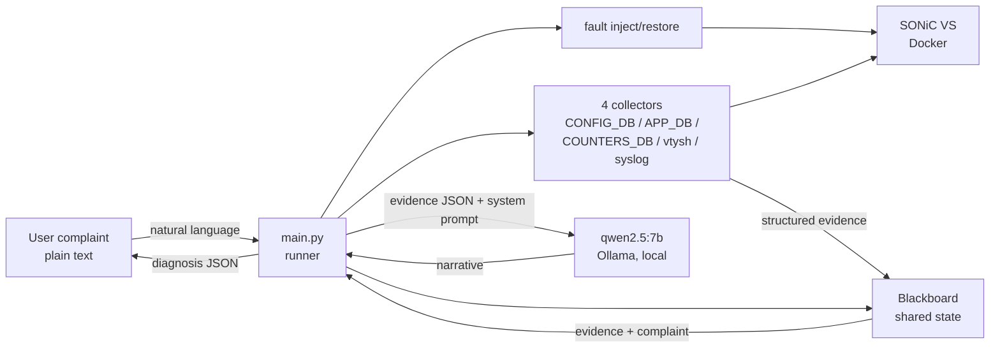

# Autonomous Network Troubleshooting Agent for SONiC

This is a portfolio project that takes a vague natural-language network complaint and produces a diagnosis grounded in live switch state. The user describes a network problem in plain English on a SONiC virtual switch. The agent investigates by reading live state from CONFIG_DB, APP_DB, COUNTERS_DB, vtysh, and syslog, populates a shared blackboard with structured evidence, and asks a local 7B model to narrate a diagnosis. Built entirely local on a MacBook M4 Pro with Ollama and Docker. No cloud APIs.

The project is structured in five phases. Phase 1, which is what ships today, is one hardcoded scenario (Ethernet4 admin down) working end-to-end. Phases 2 through 5 are planned but not built. "Autonomous" in the project title refers to the architectural intent; current autonomy is the Phase 1 wiring for one scenario, not general autonomous troubleshooting.

## Why this exists

Configuration intent is well-understood. Project 1 of this portfolio (sonic-intent-agent) covered that pattern: take a clear instruction, propose, verify, approve, apply, verify. Troubleshooting from vague complaints is harder because the investigation path emerges from evidence rather than from a predetermined plan. The blackboard pattern fits this shape: a shared workspace where structured evidence accumulates and a narrator interprets the accumulated picture.

NIKA (arxiv 2512.16381) benchmarks LLM agents on this problem against Kathara-emulated networks. I did not find a SONiC-equivalent open troubleshooting benchmark in the prior art reviewed for this project. Commercial implementations exist (Aviz Network Copilot uses a fine-tuned Llama 70B on SONiC; Cisco announced AgenticOps with multi-hypothesis autonomous troubleshooting in February 2026). This project is an open-source educational version of that pattern using a 7B local model.

## Architecture

Three decisions shape everything that follows.

Python owns investigation flow. Qwen narrates structured evidence; it does not decide what to investigate. The reason is honest: 7B-scale models are too weak to drive multi-step troubleshooting reliably. The NIKA benchmark reports GPT-OSS:20B at 19% / 5.5% / 5.5% on detection / localization / root-cause-analysis tasks, and `qwen2.5:7b-instruct` is smaller. Python collects facts; Qwen explains them.

Blackboard at the top level. A shared Python object holds evidence, hypotheses, and the final diagnosis. Mutation is explicit through methods; reads return defensive deep copies so the audit trail can only be modified through `add_evidence`, `add_hypothesis`, and `set_diagnosis`. The blackboard maps to the exploratory nature of troubleshooting: Cisco AgenticOps publicly describes "validating multiple hypotheses simultaneously", which matches the planned direction for this project's later blackboard-based phases, not the current Phase 1 implementation.

Diagnose only, no remediation. The system prompt forbids the model from suggesting next commands or remediation steps, even when the obvious fix would be a single line. The `restore` step in `main.py` is lab cleanup for the injected fault, not autonomous fix-application.

The Phase 1 flow:

    +-----------------+       +------------------+
    | User complaint  |       | qwen2.5:7b       |
    |   (plain text)  |       | (Ollama, local)  |
    +--------+--------+       +--------+---------+
             |                         ^
             v                         |
    +-----------------+    evidence    |
    |    main.py      +--------------->+
    |    (runner)     |    narrative   |
    +--------+--------+<---------------+
             |
       +-----+------+----------+----------+
       |            |          |          |
       v            v          v          v
    +-----+   +----------+ +----------+ +-----------+
    |fault|   |collectors| |blackboard| |  Ollama   |
    |inject|  |   x4     | | (shared  | |   HTTP    |
    +--+--+   +-----+----+ |  state)  | +-----------+
       |            |      +----------+
       |            v
       |     +-----------+
       +---->|SONiC VS   |
             |  (Docker) |
             +-----------+

The same flow as a Mermaid diagram (visible when this README is viewed on GitHub):

## Status: Phase 1 complete

Phase 1 ships one hardcoded scenario (Ethernet4 admin down) working end-to-end. The runner injects the fault, collects evidence through four collectors, populates a blackboard, calls the diagnosis agent, prints the diagnosis as JSON, and restores the fault.

Files that make up Phase 1:

    scripts/bringup.sh                 brings SONiC services to operational state
    faults/interface_admin_down.py     reversible fault injection
    collectors/sonic_state.py          four evidence collectors
                                       (interface state, counters,
                                       BGP summary, syslog)
    blackboard/blackboard.py           shared state container with set-once
                                       diagnosis and deep-copy isolation
    agents/diagnosis.py                Qwen narrator over blackboard evidence
    main.py                            end-to-end runner

See [`phase1/README.md`](phase1/README.md) for what was built, what was verified, what was learned, and what was deliberately scoped out.

## Quickstart

Prerequisites (one-time setup):

- Docker Desktop on macOS with at least 12 CPUs and 7-8 GB RAM allocated (M4 Pro reference setup)
- Ollama running with `qwen2.5:7b-instruct` pulled (`ollama pull qwen2.5:7b-instruct`)
- Python 3.11 or newer
- The SONiC VS base image built locally. The build steps live in the companion project, since that's where the SONiC VS infrastructure was first set up: <https://github.com/ChandanaNandi/sonic-intent-agent>

Bring the troubleshoot container into an operational state:

    ./scripts/bringup.sh

Run the end-to-end scenario:

    python3 main.py

Expected runtime is roughly 20-30 seconds, most of it Ollama inference. The diagnosis dict goes to stdout as a single JSON document; section headers, before-and-after snapshots, and inject/restore progress all go to stderr, so the diagnosis can be piped to `jq` or redirected to a file cleanly.

Two other run modes:

    python3 main.py --dry-run      verify setup, no mutation, no Ollama call
    python3 main.py --keep-fault   inject and diagnose, then skip restore

## Honest scope

What this project is, as of Phase 1:

- One troubleshooting scenario end-to-end (admin-down on `Ethernet4`)
- A working blackboard pattern with a local 7B model in the narrator role
- Honest evidence hygiene at the runner layer: `main.py` filters the SONiC VS synthetic oper-error cascade (`mac_local_fault`, `fec_sync_loss`, and similar lines that the virtual switch emits on admin-down) so the narrator does not misdescribe an intentional admin shutdown as a hardware failure

What this project is not:

- A general-purpose autonomous troubleshooting agent. Today's autonomy is one hardcoded flow.
- A benchmark against NIKA, NetConfEval, or similar
- A multi-agent system. Only the diagnosis agent uses the LLM today; the triage, interface-state, BGP/routing, and logs/counters specialists named in the architecture plan do not exist yet
- Production-ready (no authentication, no audit logging beyond the in-memory blackboard, no multi-operator coordination)

## What is planned

- **Phase 2.** The remaining five fault scenarios: BGP neighbor removal, BGP ASN mismatch, `bgpd` container restart, route missing, counter/log-based degradation.
- **Phase 3.** Multi-agent participation on the blackboard: triage, interface-state, BGP/routing, and logs/counters specialists alongside the diagnosis narrator.
- **Phase 4.** Evaluation harness with detection / localization / root-cause-analysis scoring on 10-15 scenarios.
- **Phase 5.** Polish, demo script, and a top-level findings writeup.

## Related work

The links below were used as architectural reference points. Where details beyond an arxiv ID, a short description, and (where known) author and affiliation are not stated here, they were not verified.

- arxiv 2507.01701 — blackboard architecture for LLM multi-agent systems (Han, Zhang, July 2025). <https://arxiv.org/abs/2507.01701>
- arxiv 2509.20600 — LLM agent framework compiling YANG to SONiC (Lin, Zhou, Yu — Meta / Stony Brook / Harvard, September 2025). <https://arxiv.org/abs/2509.20600>
- arxiv 2512.16381 — NIKA benchmark for LLM agents on network troubleshooting using Kathara (December 2025). Source of the GPT-OSS:20B 19 / 5.5 / 5.5% detection / localization / root-cause numbers cited above. <https://arxiv.org/abs/2512.16381>
- Aviz Network Copilot — commercial reference using a fine-tuned Llama 70B on SONiC. <https://aviznetworks.com>
- Cisco AgenticOps — announced autonomous troubleshooting product in February 2026. <https://newsroom.cisco.com/c/r/newsroom/en/us/a/y2026/m02/cisco-expands-agenticops-innovations-across-portfolio.html>

## Companion project

This is the second project in a two-project portfolio exploring local-LLM agent patterns on SONiC. The first project covers intent-based configuration with formal verification: <https://github.com/ChandanaNandi/sonic-intent-agent>.

## License

MIT License. See the [LICENSE](LICENSE) file for the full text.

## Author

Chandana Nandi. <https://github.com/ChandanaNandi>
