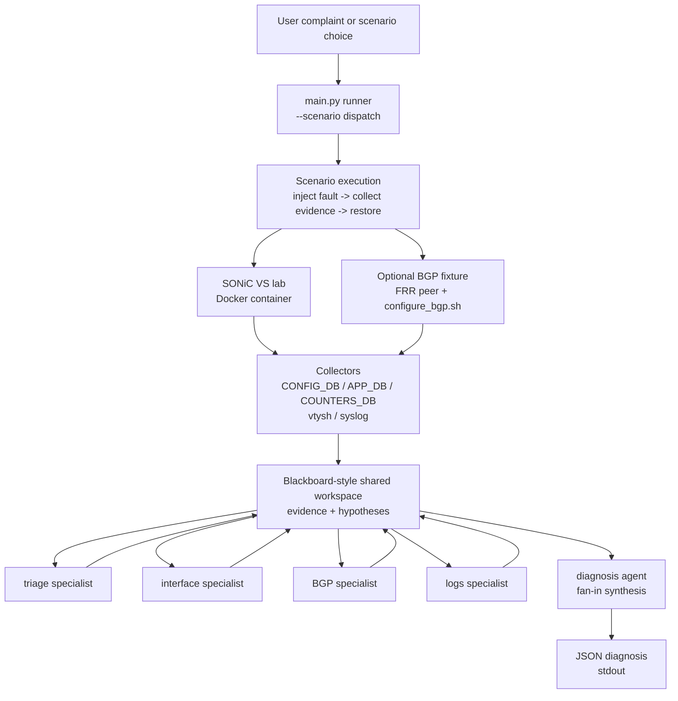

# Autonomous Network Troubleshooting Agent for SONiC

A local SONiC troubleshooting agent that injects a reversible fault on a SONiC virtual switch, reads live state from CONFIG_DB / APP_DB / COUNTERS_DB / `vtysh` / syslog, posts evidence to a blackboard-style shared workspace, runs four specialist LLM agents in fan-out, and synthesizes a diagnosis. Runs entirely locally with Docker, SONiC VS, FRR, Ollama, and `qwen2.5:7b-instruct`. No cloud APIs.


## What it does

- Runs three reversible troubleshooting scenarios end-to-end (inject → collect → diagnose → restore):
  - `interface_admin_down` — admin-shutdown of `Ethernet4`
  - `bgp_neighbor_removal` — BGP neighbor removed via `vtysh`
  - `bgp_asn_mismatch` — wrong remote-as on the BGP neighbor
- Collects structured evidence from CONFIG_DB, APP_DB, COUNTERS_DB, `vtysh`, and `/var/log/syslog` inside the switch container
- Runs four specialist agents in fan-out (`triage`, `interface`, `bgp`, `logs`), each scoped to a single evidence slice
- Synthesizes evidence plus specialist hypotheses with a diagnosis agent (fan-in) and emits a single JSON diagnosis to stdout
- Brings up and tears down a two-container BGP lab fixture automatically for the BGP scenarios
- Restores injected faults after each run (lab cleanup, not autonomous remediation)


## Demo

```
./scripts/bringup.sh
python3 main.py --scenario interface_admin_down
python3 main.py --scenario bgp_neighbor_removal
python3 main.py --scenario bgp_asn_mismatch
```

`stdout` is the diagnosis JSON only; section headers, snapshots, and inject/restore progress go to `stderr`, so the diagnosis pipes cleanly:

```
python3 main.py --scenario interface_admin_down | jq -r .diagnosis
```

Excerpt from a real run of `interface_admin_down` (abbreviated):

```
=== BEFORE ===
  interface_state: admin_status=up oper_status=down
  bgp_summary: bgp_instance_present=False neighbors=0

=== INJECT (interface_admin_down) ===
  before: Ethernet4 admin_status=up
  injecting: shutting down Ethernet4
  after:  Ethernet4 admin_status=down
  inject ok: Ethernet4 is now admin down

=== AFTER ===
  interface_state: admin_status=down oper_status=down

=== SPECIALISTS (fan-out) ===
  bgp / logs / interface / triage: posted hypotheses

=== FAN-IN: DIAGNOSIS ===
diagnosis: Ethernet4 is administratively and operationally down
           (admin_status="down", oper_status="down").

=== RESTORE (interface_admin_down, test cleanup, not remediation) ===
  after:  Ethernet4 admin_status=up
  restore ok: Ethernet4 is now admin up
```

This demonstrates the core value: the diagnosis is grounded in live SONiC state collected after an injected fault, not generated from the user's text alone. The BGP scenarios follow the same runner flow, with the BGP lab created and removed automatically.

Also: `--dry-run` lists the planned steps without mutating or calling Ollama; `--keep-fault` skips restore so the injected state can be inspected manually.


## Architecture

A blackboard-inspired shared workspace with fixed fan-out / fan-in over a local 7B model.



Linear form for non-Mermaid viewers: user complaint → `main.py` runner → fault inject + collectors (plus `configure_bgp.sh` for BGP scenarios) → SONiC VS + BGP peer (Docker) → blackboard-style shared workspace → fan-out to four specialist agents → fan-in to the diagnosis agent → JSON diagnosis on stdout.

All five agents share one `qwen2.5:7b-instruct` instance via Ollama; specialization comes from prompt constraints and each specialist's evidence slice, not from model capability. Each specialist prefixes its claim with a source tag (`[triage]`, `[interface]`, `[bgp]`, `[logs]`) for attribution at synthesis. Fan-out uses `ThreadPoolExecutor(max_workers=4)`. This is not a full opportunistic blackboard scheduler; the specialist set is fixed per run.


## Repository map

```
main.py                           end-to-end runner with --scenario dispatch
scripts/bringup.sh                brings SONiC services up
scripts/configure_bgp.sh          two-container BGP lab fixture (up / down / status)
faults/                           reversible fault scripts (one per scenario)
collectors/sonic_state.py         four evidence collectors
blackboard/blackboard.py          shared workspace with deep-copy isolation
agents/                           triage, interface, bgp, logs specialists +
                                  diagnosis synthesis agent
phase1/, phase2/, phase3/         design, spike, decision, and findings docs
```


## Requirements

- Docker Desktop on macOS, Apple Silicon (M4 Pro reference: ≥12 CPUs and ≥7.5 GB RAM allocated)
- The `docker-sonic-vs-fixed:latest` SONiC VS image built locally — see the companion [`sonic-intent-agent`](https://github.com/ChandanaNandi/sonic-intent-agent) repository, which contains the SONiC VS build infrastructure
- Python 3.11+ (stdlib only; no `requirements.txt`)
- [Ollama](https://ollama.com) on `localhost:11434` with `qwen2.5:7b-instruct` pulled (`ollama pull qwen2.5:7b-instruct`)


## Scenarios

| Scenario | Fault injected | Mutation path | BGP lab fixture |
|---|---|---|---|
| `interface_admin_down` | `Ethernet4` admin-shutdown | CONFIG_DB via `config interface shutdown` | no |
| `bgp_neighbor_removal` | Removes BGP neighbor `10.10.10.2` | `vtysh` | yes |
| `bgp_asn_mismatch` | Sets `remote-as` to wrong AS (`65002`) | `vtysh` | yes |

All three are reversible; the runner restores after the diagnosis step.


## Limitations

- Scenario-bound: the runner dispatches `--scenario <one-of-three>`, not arbitrary natural-language complaints.
- No evaluation harness yet (no detection / localization / root-cause-analysis scoring).
- BGP scenarios mutate via `vtysh`; the CONFIG_DB + `bgpcfgd` path was deferred — see [`phase2/2C_CONTROL_PLANE_DECISION.md`](phase2/2C_CONTROL_PLANE_DECISION.md).
- Not a full opportunistic blackboard scheduler; the specialist set is fixed per run.
- The runner filters SONiC VS's synthetic oper-error syslog cascade for the admin-down scenario; other scenarios may need their own per-scenario log hygiene.
- Not production-ready: no authentication, no audit logging beyond the in-memory blackboard, no multi-operator coordination.


## Engineering notes

Design, spike, and decision documents:

- [`phase1/README.md`](phase1/README.md) — single-scenario end-to-end design
- [`phase2/2C_CONTROL_PLANE_DECISION.md`](phase2/2C_CONTROL_PLANE_DECISION.md) — choosing `vtysh` over `bgpcfgd` for BGP mutation
- [`phase2/2D_ASN_MISMATCH_SPIKE_FINDINGS.md`](phase2/2D_ASN_MISMATCH_SPIKE_FINDINGS.md) — ASN-mismatch evidence-shape spike
- [`phase2/2D_ASN_MISMATCH_RESTORE_FINDINGS.md`](phase2/2D_ASN_MISMATCH_RESTORE_FINDINGS.md) — comparing restore methods under deep BGP backoff
- [`phase3/README.md`](phase3/README.md) — multi-agent fan-out / fan-in design, concurrency, attribution scheme


## Related work

Architectural reference points. Where details beyond an arxiv ID, a short description, and (where known) author and affiliation are not stated here, they were not verified.

- arxiv 2507.01701 — blackboard architecture for LLM multi-agent systems (Han, Zhang, July 2025). <https://arxiv.org/abs/2507.01701>
- arxiv 2509.20600 — LLM agent framework compiling YANG to SONiC (Lin, Zhou, Yu — Meta / Stony Brook / Harvard, September 2025). <https://arxiv.org/abs/2509.20600>
- arxiv 2512.16381 — NIKA benchmark for LLM agents on network troubleshooting using Kathara (December 2025). <https://arxiv.org/abs/2512.16381>
- Aviz Network Copilot — commercial reference using a fine-tuned Llama 70B on SONiC. <https://aviznetworks.com>
- Cisco AgenticOps — autonomous troubleshooting product announced February 2026. <https://newsroom.cisco.com/c/r/newsroom/en/us/a/y2026/m02/cisco-expands-agenticops-innovations-across-portfolio.html>


## Companion project

[`sonic-intent-agent`](https://github.com/ChandanaNandi/sonic-intent-agent) — intent-based SONiC configuration with formal verification. The first project in this two-project portfolio.


## License

MIT License. See [`LICENSE`](LICENSE).


## Author

Chandana Nandi. <https://github.com/ChandanaNandi>
